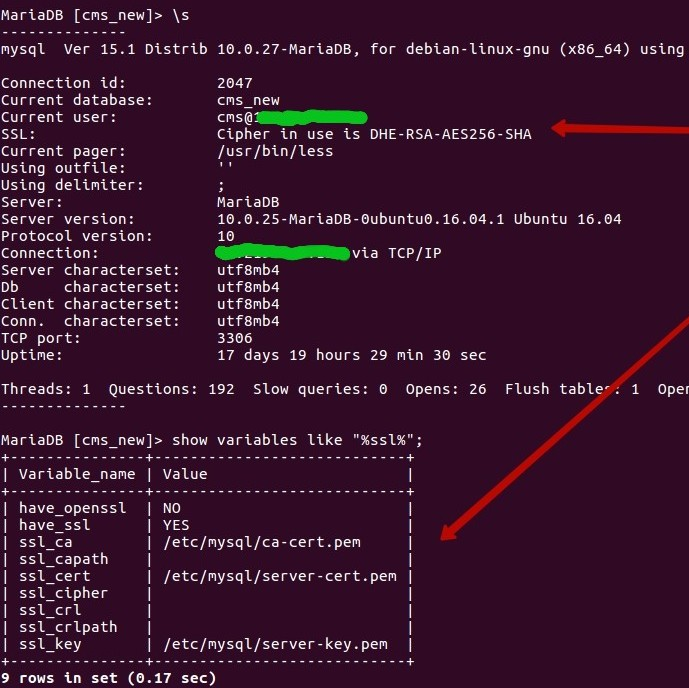

# Работа SQL с SSL

## MySQL MariaDB Percona

- Генерим сертификат корневой и серверный

```bash

sslmysql.sh
```
- Генерим сертификат для клиента

```bash

sslmysql-client.sh clietn_01
```

- Прриводим конфиг к такому виду

```bash

grep ssl /etc/mysql/mariadb.conf.d/50-server.cnf

ssl-ca=/etc/mysql/ca-cert.pem
ssl-cert=/etc/mysql/server-cert.pem
ssl-key=/etc/mysql/server-key.pem
```

- Создаём юзера (client1) с доступом к базе (megadb) и паролем (megapassword), укажем что бы пользовался SSL (REQUIRE SSL)

```bash

mysql -A -h'localhost' -u'root' -p'megapassword' -e"GRANT ALL PRIVILEGES ON megadb.* TO 'client1'@'%' IDENTIFIED BY 'megapassword' REQUIRE SSL"
```

- Дальше правим конфиг на клиенте

лобально
```bash

vi /etc/mysql/my.cnf
```

либо локально для себя
```bash

vi ~/.my.cnf
```

- у меня тестовый вариант выглядит так
```
cat ~/.my.cnf
[client]
ssl-ca=/home/dtulyakov/SSL/mysql/ca-cert.pem
ssl-cert=/home/dtulyakov/SSL/mysql/client-client_01-cert.pem
ssl-key=/home/dtulyakov/SSL/mysql/client-client_01-key.pem
```
- Пример однго из серверов

